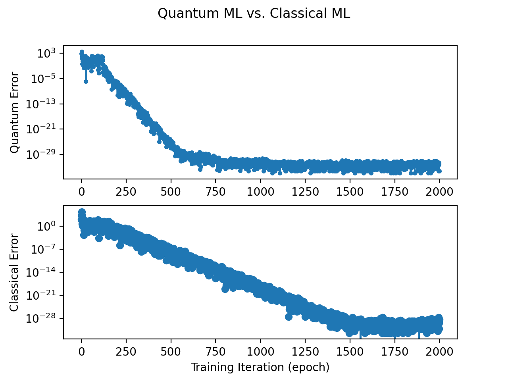

# Quantum Machine Learning vs Classical ML

Quantum Machine Learning is claimed to be better.
Faster deep learning training.
Higher accuracy on smaller data sets.

> Goal: Build a QSVM (Quantum Support Vector Machine) where D-Wave QPU provides
> weights to be used in classical SVM prediction models.
> Improvements we want include: speedup and higher accuracy.

## Quantum Results are Promising

Quantum ML converges more quickly than classical.
With fewer training cycles, this can be considered a speedup.

The following figures are training sessions comparing 
Quantum Machine Learning with Classical Machine Learning.
The images are represented using the same hyper parameters.

### Quantum ML vs Classical ML

Comparing using the same hyper parameters.
**Lower points** on the charts are **better**.


This second figure shows similar results.
Note that the Quantum converges more quickly.



As you can see, the QSVM outperforms the Classical SVM.
This happens most of the time.
The RNG nature of initial weights may change the outcome.

## Try it out

Both docker and local python follow here.
You will need to run the training session multiple times.
This is because sometimes the model will miss convergence.
You'll get results representing quantum optimizations.
Nearly all Quantum runs show that the MSE is one order
of magnitude more optimal than the classical.

### Run with Python Locally

Running on your local machine, use these following commands.

```shell
pip install -r requirements.txt
python main.py
```

### Run with Docker

```shell
docker build . -t quantum-ml
docker run -e DWAVE_API_KEY=YOUR_API_KEY quantum-ml
```

## Quantum Training Approach

Looking to take a conventional Machine Learning Algorithm
with SGD (stochastic gradient decent) on an SVM (support vector machine)
and apply it in a quantum circuit.

It seems that using a quadratic unconstrained binary optimizer for
finding weight outputs can generate usable AI weights that can be
applied in classical computation.
This will accelerate training time.
This should improve accuracy.

There are several approaches to using Quantum Circuits as a solver.
Quantum Machine Learning appears solvable with a BQM / QUBO.

We need to generate a shallow neural net matrix weights
to be used in predicting outcomes.
In addition, deep learning with multi-layer neural nets.

## Challenges with Quantum Machine Learning

The Quantum chip (QPU) is programmable using assembly-like instructions.
Making the task that much more tricky.

## Quantum Leap: Optimization

An optimization strategy is to reduce the number of sampling events
required when measuring optimal weight adjustments for each epoch.
Instead of sampling the weights each epoch,
we can instead sample 10x fewer times
keeping a cache of the most recent quantum samples.

It's not needed to obtain a quantum sample every epoch.
The convergence hasn't approached most recent sampling optimizations.
This approach may reduce training time.

## Conclusion

Overall, quantum delivers on the promise.
The addition of Quantum in Machine Learning has shown to achieve our goal.
Quantum is faster.
Quantum creates more accurate models.
Also, as a bonus, Quantum can reduce training data
volume requirements for deep learning.
